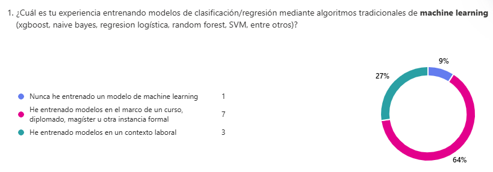
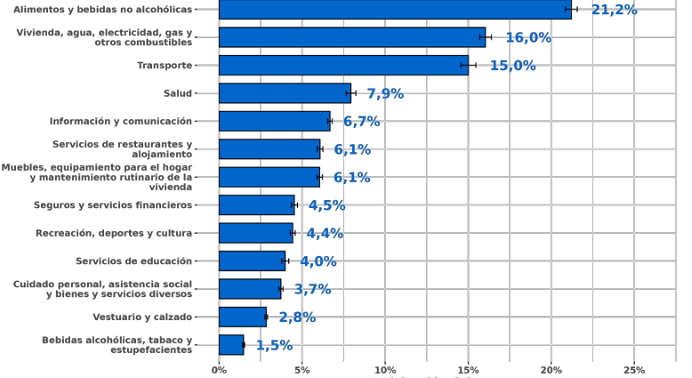
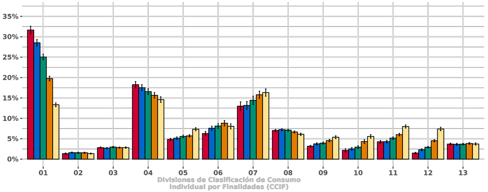
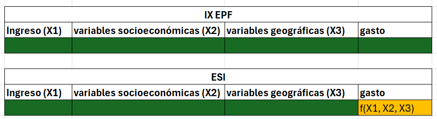
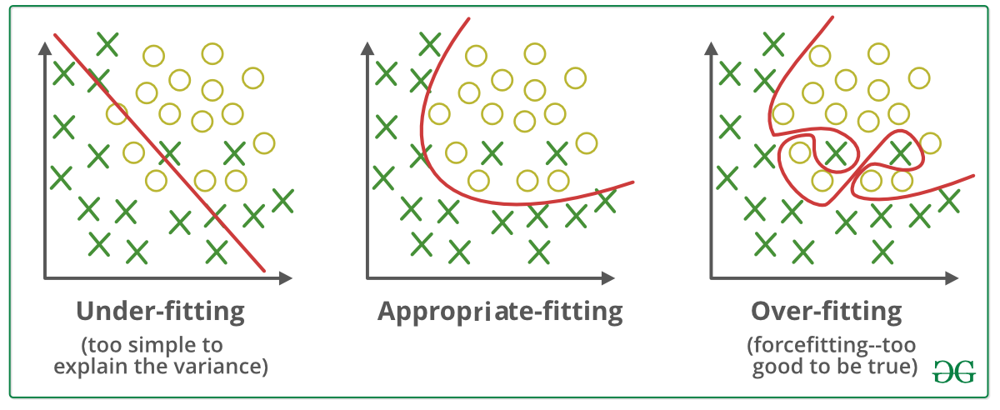

##  {#portada .portada}

::: logo-box

:::

::: title-area
<h1>Conceptos básicos sobre aprendizaje supervisado</h1>

<br>

<h2>Área de Ciencia de Datos</h2>

<h2>Unidad de Gobierno de Datos</h2>

<p><strong>Mayo 2026</strong></p>
:::

## Objetivo de la sesión

{.absolute style="top:200px; left:800px; width:1100px; height:500px;"}

. . .

<br> <br> <br> <br> <br> <br> <br> <br>

**Revisaremos algunos conceptos relevantes sobre aprendizaje supervisado**

. . .

¿Qué **NO** es esta clase?

-   Revisión completa sobre *machine learning*

. . .

¿Qué **SÍ** es esta clase?

-   Repaso de conceptos fundamentales\
-   Delimitación de una terminología compartida para lo que vendrá

## Motivación

La EPF nos permite conocer cada 5 años la estructura de gasto de los hogares

<br> <br> <br> <br> <br> <br>

{.absolute style="top:1px; left:100px; width:800px; height:400px;"}

{.absolute style="top:1px; left:1200px; width:900px; height:500px;"}

<br> <br> <br> <br> <br>

### No sabemos qué pasa entre las recolecciones :(

## Idea

**Sabemos que el monto y estructura de gasto está fuertemente correlacionado con:**

-   El ingreso
-   Información sociodemográfica (edad, sexo, etc)
-   Información geográfica

{.absolute style="top:20px; left:1600px; width:800px; height:400px;"}

. . .

Podemos entrenar un modelo para que prediga el gasto

. . .

Necesitamos predictores que tengan una mayor periodicidad que la EPF

. . .

-   ESI
-   CASEN
-   Otra

{.absolute style="top:165px; left:400px; width:1200px; height:300px;"}

## Paso 0: estructurar dataset

Trabajaremos con datos de la IX EPF

```{r}
# Cargar datos
library(tidyverse)
gastos = read_csv2("data/base-gastos-ix-epf-(formato-csv).csv")
personas = read_csv2("data/base-personas-ix-epf-(formato-csv).csv")

# Variables predictoras del sustentador principal
hogar_x = personas %>%
  filter(sprincipal == 1) %>% 
  select(folio, ing_disp_hog_hd, macrozona, cine_a, sexo, npersonas, cae, edad ) %>% 
  filter(!is.na(folio)) %>% 
  mutate(quintil = ntile(ing_disp_hog_hd, 5))

```

<br>

Escogemos algunos productos

```{r}
quinoa <- gastos %>%
  filter(ccif == "01.1.1.01.03" ) %>% # quinoea
  mutate(quinoa = 1) %>% 
  select(folio, quinoa) 

salmon <- gastos %>%
  filter(ccif == "01.1.3.01.03" ) %>%  # salmon
  mutate(salmon = 1) %>% 
  select(folio, salmon) 

lomo_filete <- gastos %>%
  filter(ccif == "01.1.2.02.03" ) %>% # lomo y filete
  mutate(lomo_filete = 1) %>% 
  select(folio, lomo_filete) 

bencina <- gastos %>%
  filter(ccif == "07.2.2.02.01" ) %>% # bencina
  mutate(bencina = 1) %>% 
  select(folio, bencina) 
  

  


```

## Paso 0: estructurar dataset

### Haremos el ejemplo con bencina

```{r}

SELECTED_Y = "bencina"

# Se unen los distintos fragmentos 
full <- hogar_x %>%
  left_join(quinoa, by = "folio") %>% 
  left_join(salmon, by = "folio") %>% 
  left_join(lomo_filete, by = "folio") %>% 
  left_join(bencina, by = "folio") %>% 
  mutate(
    across(
      c(quinoa, salmon, lomo_filete, bencina),
      ~ if_else(is.na(.x), 0, .x)
    )
  ) 


```

<br/>

```{r}
# El código que viene es para crear la que le pasaremos al clasificador
vars_cat <- c("macrozona", "cine_a", "sexo", "cae", "quintil")
vars_num <- c("npersonas", "edad")

full_final <- full %>% 
  mutate(across(all_of(vars_cat), as.factor )) %>% 
  select(all_of(c(vars_cat, vars_num))) %>% 
  model.matrix(~ . - 1, data = .) %>% # la función sabe que solo debe cambiar los factores
  as.data.frame() %>% 
  bind_cols( full[SELECTED_Y]) # variable a predecir
```

## Paso 0: revisemos el dataset

```{r}
library(DT)
datatable(
  full_final,
  options = list(pageLength = 5, scrollX = TRUE),
  rownames = FALSE
)
```

## Paso 0.1: revisar si nuestras covariables tienen sentido

```{r}
# Función para crear tablas
create_table <- function(df, var, x_var) {
  table <- df %>% 
    group_by(across(all_of(c(var, x_var))) ) %>% # jerga dplyr para trabajar con strings
    summarise(n = n()) %>% 
    group_by(across(all_of(x_var))) %>% 
    mutate(total_grupo = sum(n)) %>%
    ungroup() %>% 
    filter(across(all_of(var)) == 1) %>% 
    mutate(porcentaje = n / total_grupo * 100)
  return (table)
}


```

Revisamos si existe alguna relación entre ingreso y consumo de bencina

```{r}
create_table(full, "bencina", "quintil")

```

## Paso 0.1: revisar si nuestras covariables tienen sentido

```{r}
create_table(full, "bencina", "cae")
create_table(full, "bencina", "macrozona")
create_table(full, "bencina", "cine_a")
create_table(full, "bencina", "sexo")

```

## Paso 1: separar entre test y train

**Muy importante**: Siempre se debe testear en datos que el modelo no ha visto

{fig-align="center" style="height:1000px;"}

## Paso 1: separar entre test y train

```{r}
#install.packages("rsample") por si no la tienen
library(rsample)
set.seed(123)
split <- initial_split(full_final, prop = 0.8)
train <- training(split)
test  <- testing(split)
```

## Paso 2: entrenamos

Existen muchos algoritmos

- Regresión logística
- Naive Bayes
- SVM
- Random Forest
- Muchos más

. . .

Nosotros usaremos **xgboost**

- Bueno, bonito y barato
- Árboles con boosting
- Utiliza el algoritmo de descenso de gradiente 


. . .

El algorítmo tiene varios reconocimientos

Implementaciones en varios lenguaje de alto nivel (python, R, Julia )

Documentación completa [aquí](https://xgboost.readthedocs.io/en/release_3.2.0/R-package/index.html)


## Paso 2: entrenamos


```{r}
# install.packages("xgboost") por si no lo tienen instalado
library(xgboost)

X_train <- train %>% 
  select(-  all_of(SELECTED_Y) ) %>% 
  as.matrix()

y_train <- as.matrix(train[SELECTED_Y]) # ¡¡esta operación es cara!!

X_test  <- test %>% 
  select(-all_of(SELECTED_Y) ) %>% 
  as.matrix()

y_test  <- as.matrix(test[SELECTED_Y])

dtrain <- xgb.DMatrix(data = X_train, label = y_train)
dtest  <- xgb.DMatrix(data = X_test,  label = y_test)

# Para lidiar con el desbalance
scale_pos_weight <- sum(y_train == 0) / sum(y_train == 1)

# Elegimos algunos hiperparámetros
params <- list(
  objective        = "binary:logistic",
  eval_metric      = c("auc", "error"),
  max_depth        = 3, # mucha profundidad induce overfitting
  eta              = 0.1
  #scale_pos_weight = scale_pos_weight  # penaliza más los errores en clase minoritaria. No lo usaremos
)

# Ejecutar entrenamiento
modelo <- xgb.train(
  params    = params,
  data      = dtrain,
  nrounds   = 50,
  evals = list(train = dtrain, test = dtest), # nos indica el overfitting
  verbose   = 1
)
```

## Paso 3: testeamos

```{r}
importancia <- xgb.importance(model = modelo)
xgb.plot.importance(importancia, top_n = 5)
```

## Paso 3: testeamos

Construiremos una matriz de confusión

```{r}
# Probabilidad predicha de comprar salmón
pred_prob <- predict(modelo, dtest)

# Fijamos umbral de 0.5
umbral <- 0.5
pred_clase <- ifelse(pred_prob > umbral, 1, 0)

# Comparar con valores reales
cm <- table(real = y_test, predicho = pred_clase)
cm


```

## Paso 3: testeamos

Dos métricas muy utilizadas para evaluar desempeño:
- Accuracy
- F1 score

```{r}
tp <- cm[2, 2]
fp <- cm[1, 2]
fn <- cm[2, 1]

acc <- sum(diag(cm)) / sum(cm)
f1  <- tp / (tp + 0.5 * (fp + fn))

cat("Accuracy:", round(acc, 3), "\n")
cat("F1 score:", round(f1, 3), "\n")

```

## Hablemos del ajuste 


{fig-align="center" style="height:1000px;"}


## Hablemos del ajuste

Comparemos accuracy en ambas particiones

```{r}
# Predicciones en train
pred_train_prob  <- predict(modelo, dtrain)
pred_train_clase <- ifelse(pred_train_prob > umbral, 1, 0)
cm_train <- table(real = y_train, predicho = pred_train_clase)

acc_train <- sum(diag(cm_train)) / sum(cm_train)
acc_test  <- sum(diag(cm)) / sum(cm)

cat("Accuracy train:", round(acc_train, 3), "\n")
cat("Accuracy test: ", round(acc_test,  3), "\n")
```

. . .

Si existe una distancia muy grande, es una señal de que hay overfitting

Podemos usar técnicas de regularización

## Generemos overfitting

Mucha profundidad

Muchas rondas

```{r}
# Elegimos algunos hiperparámetros
params <- list(
  objective        = "binary:logistic",
  eval_metric      = c("auc"),
  max_depth        = 15, # mucha profundidad induce overfitting
  eta              = 0.1
  #scale_pos_weight = scale_pos_weight  # penaliza más los errores en clase minoritaria. No lo usaremos
)

# Ejecutar entrenamiento
modelo <- xgb.train(
  params    = params,
  data      = dtrain,
  nrounds   = 100, # muchas rondas
  evals = list(train = dtrain, test = dtest), # nos indica el overfitting
  verbose   = 1
)
```


## Bonus: búsqueda de hiperparámetros

¿Cómo podemos saber cuál es la mejor combinación de hiperperámetros?

```{r}
grilla <- expand.grid(
  max_depth = c(3, 5, 7),
  eta       = c(0.05, 0.1, 0.3)
)

resultados <- purrr::map_dfr(seq_len(nrow(grilla)), function(i) {
  p <- list(
    objective        = "binary:logistic",
    eval_metric      = "auc",
    max_depth        = grilla$max_depth[i],
    eta              = grilla$eta[i],
    scale_pos_weight = scale_pos_weight
  )

  m <- xgb.train(p, dtrain, nrounds = 50, verbose = 0)
  auc <- as.numeric(predict(m, dtest))
  pred <- ifelse(auc > 0.5, 1, 0)
  cm_i <- table(factor(y_test, 0:1), factor(pred, 0:1))
  tp_i <- cm_i[2,2] 
  fp_i <- cm_i[1,2]
  fn_i <- cm_i[2,1]

  tibble(
    max_depth = grilla$max_depth[i],
    eta       = grilla$eta[i],
    f1        = round(tp_i / (tp_i + 0.5*(fp_i + fn_i)), 3),
    acc       = round(sum(diag(cm_i)) / sum(cm_i), 3)
  )
})

resultados %>% arrange(desc(f1))
```

## Dejamos fuera varios elementos

-   Regularización
-   Modelo de regresión
-   Validación cruzada
-   Partición en 3 (train/val/test)
-   Ensambles de modelos
-   Data drift

## Lo importante

-   Entrenamos modelos para que aprenden reglas implícitas, que luego puedan reproducir
-   El modelo debe aprender a generalizar y no "memorizar" los datos
-   Siempre debe testearse el modelo en datos que no haya visto

. . .

**Estos principios aplican para cualquier estrategia de aprendizaje supervisado**


##  {#cierre .portada}

::: logo-box

:::

::: title-area
<h1>Título</h1>

<h2>Unidad de Gobierno de Datos</h2>

<p><strong>Fecha</strong></p>
:::